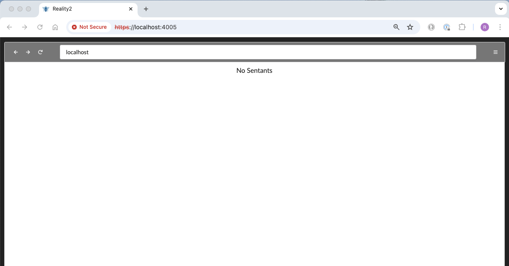

# Installation

Warning - this is not yet usable by people who are not happy getting into the Linux command line.  If you need help, find a linux guru and entice them with pizza and coffee to give you a hand.

The instructions below are for installing and using the reference implementation of the Reality2 Node that has been built in Elixir.

### Pre-compiled

There are some versions of Reality2 Nodes pre-compiled, ready for use.  This is the easy way to get going...

To use, head over to the [releases](https://github.com/roycdavies/reality2/releases) section of the [reality2-node-core-elixir](https://github.com/reality-two/reality2-node-core-elixir) repository and download the appropriate version.  Further instructions are there.

### Compile-it-yourself

If there is no version for your platform and OS, then you'll have to do it the hard way...  Reality2 nodes work on any unix-like operating system such as Linux, BSD and MacOS.  It should work under WSL on Windows as well.

#### Step 1

- Read the documentation.  If you've got this far, great - keep reading...

#### Step 2

- Clone the [reality2-node-core-elixir](https://github.com/reality-two/reality2-node-core-elixir) GIT repository.  If that instruction doesn't make sense to you, then you should go find that Linux guru.
- I suggest creating a folder called Reality2, and cloning the repository into that folder.  You will end up with a folder inside the Reality2 folder called 'reality2-node-core-elixir'.  In the main Reality2 folder, you can create useful files for private API keys without them ending up in the repository.  For example, below, we create a file to hold your OpenAI API key.

```bash
mkdir Reality2
cd Reality2
git clone https://github.com/reality2-roycdavies/reality2-node-core-elixir.git
echo sk-[YOUR OPENAI API KEY HERE] > OPENAI_API_KEY.txt
cd reality2-node-core-elixir
```

#### Step 3

- Install Erlang and Elixir.  I have found that the installations via [asdf](https://asdf-vm.com/) are good, and you can get the latest versions of Erlang and Elixir.  Be warned, though, that Erlang is compiled from source using this method.  This is mostly fine, except when trying to install on a small wearable linux computer with limited processing power as it can take some time.
- Depending on the version of the OS you are using, you may be able to use the included versions of Erlang and Elixir.  Reality2 requires the newer versions, but, for example, the latest Ubuntu has those in the repository.  In which case, using the standard ways to install (eg with apt-get) will suffice.
- You may need to install some libraries to compile Erlang (e. for Debian based Linux):

```bash
sudo apt install libssl-dev automake autoconf libncurses5-dev
```

```bash
asdf plugin add erlang
asdf install erlang latest

# Make sure you are in the main directory for Reality2
# eg cd Reality2
asdf global erlang latest
asdf local erlang latest

asdf plugin add elixir
asdf install elixir latest

# Make sure you are in the main directory for Reality2
# You should already be there after installing Erlang
asdf global elixir latest
asdf local elixir latest
```

#### Step 4 

- Install Rust (at least, if you are intending to use the Rust plugins).  The best place to see how to do that is [here](https://www.rust-lang.org/tools/install).

#### Step 5

- Install the Elixir plugins.  The framework we are using is the [Pheonix Framework](https://www.phoenixframework.org/), with [Absinthe](https://absinthe-graphql.org/) for the GraphQL.

```bash
cd scripts
./deps.get
```

#### Step 6

- Build the web interface.  This uses yarn for the building (rather than npm), and various libraries, including [svelte-fomantic-ui](https://github.com/roycdaviesuoa/svelte-fomantic-ui) also made by the author of Reality2.  So, obviously, you'll have to have installed [yarn](https://yarnpkg.com/) first.
- It's possible you might need to install the latest version of Node.JS.  You can use ASDF for that too.

```bash
asdf plugin add nodejs
asdf install nodejs latest

# Make sure you are in the web/sentants directory for Reality2
# eg: cd web/sentants
asdf global nodejs latest
asdf local nodejs latest

npm install -g yarn
```

```bash
cd scripts
./build_webapp sentants
```

#### Step 7

- Run the Reality2 node.  From the scripts directory, set it is going.

```bash
# In the scripts folder.
./run_as_dev
```

or, if you want to test production mode:

```bash
# In the scripts folder.
./run_as_prod
```

You can also just use the `run` command in the main folder to run in developer mode.

You should see something like this (may vary depending on the plugins installed, and the current version of erlang and elixir):

```bash
[ai.reality2 0.1.9] started successfully.
[ai.reality2.backup 0.1.9] started successfully.
[ai.reality2.data 0.1.9] started successfully.
[ai.reality2.web 0.1.9] started successfully.
[ai.reality2.geospatial 0.1.9] started successfully.
Erlang/OTP 26 [erts-14.1.1] [source] [64-bit] [smp:12:12] [ds:12:12:10] [async-threads:1] [jit:ns]

Interactive Elixir (1.16.3) - press Ctrl+C to exit (type h() ENTER for help)
iex(1)> 
```

Congratulations, you now have a Reality2 node up and running.  Feels good, doesn't it?  Your life is coming together.

#### Step 8

- Have a look at it.  Open a browser and go to `https://lcoalhost:4005`.  Click past the info about this being a potentially dangerous site due to self-signed certificates.  You accept the risk, right? (if you want, you can make your own certificates - a good idea actually - that can be a bit of homework).




- Not surprisingly, there is nothing to see, because you haven't loaded any Sentants yet, but we know it is up and running, and the web interface is working.

#### Troubleshooting

- There are many places where this can fail.  Because you are compiling and running from source, you have to have all the libraries and tools in place first, and then you can run the Reality2 Node.
- The release versions are precompiled and packaged to be ready to run for different architectures.