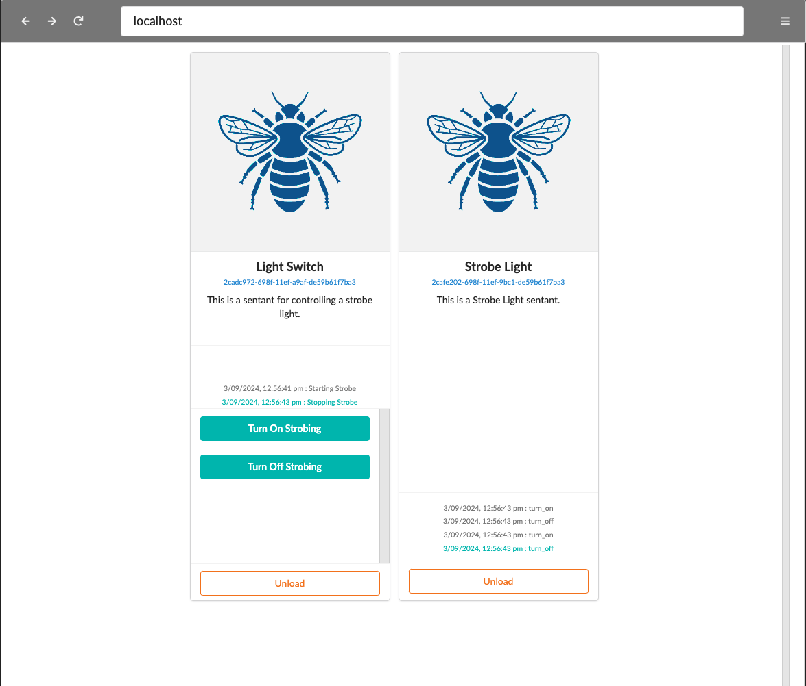
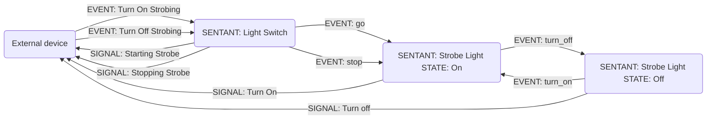

# Testing

At this point, you are feeling jubilant because you have compiled and run a Reality Node.  Congratulations, you are obviously a Linux guru and can get other people to buy you pizza and coffee.

Now let's add some Sentants.

Head on over to the Reality2 Git repository [https://github.com/reality-two/reality2-definitions](https://github.com/reality-two/reality2-definitions).

Inside the main folder, there is a folder called 'python' which, perhaps not surprisingly, contains some python code that sets up some Sentants.

In the Sentants and Swarms folders, You can also find examples of YAML and JSON files with Sentant and Swarm definitions.

Start yourself a new terminal, leaving the other one you used to start the Reality2 node running, and type the following (I'm assuming you have python3 installed - most linux distributions do):

```bash
cd python
./load ../swarms/ai.reality2.pi_light_and_switch.swarm.json
```

This probably won't work because there are some libraries to install first, most notably:

```bash
pip install gql
pip install requests
pip install websockets
pip install getkey
pip install ruamel.yaml
pip install toml
```

After doing that, try running the code again, and you should see something like this:

````
Unloading existing Sentants named " ['Light Switch', 'Strobe Light'] "
Joined: wss://localhost:4005/reality2/websocket
Joined: wss://localhost:4005/reality2/websocket
Subscribed to 2cadc972-698f-11ef-a9af-de59b61f7ba3|debug
Subscribed to 2cafe202-698f-11ef-9bc1-de59b61f7ba3|debug
Joined: wss://localhost:4005/reality2/websocket
Joined: wss://localhost:4005/reality2/websocket
Joined: wss://localhost:4005/reality2/websocket
Joined: wss://localhost:4005/reality2/websocket
Subscribed to 2cadc972-698f-11ef-a9af-de59b61f7ba3|Starting Strobe
Subscribed to 2cafe202-698f-11ef-9bc1-de59b61f7ba3|turn_on
Subscribed to 2cafe202-698f-11ef-9bc1-de59b61f7ba3|turn_off
Subscribed to 2cadc972-698f-11ef-a9af-de59b61f7ba3|Stopping Strobe
[{'event': 'Turn On Strobing', 'parameters': {}, 'id': '2cadc972-698f-11ef-a9af-de59b61f7ba3'}, {'event': 'Turn Off Strobing', 'parameters': {}, 'id': '2cadc972-698f-11ef-a9af-de59b61f7ba3'}]
---------- Send Events ----------
 Press [ 0 ] for { Turn On Strobing {} }
 Press [ 1 ] for { Turn Off Strobing {} }
 Press [ h ] for help.
 Press [ q ] to quit.
---------------------------------
0 1 h q >
````

And the webpage should have updated itself to look like this:




If you press the 'Turn On Strobing' button, you should see the 'Strobe Light' Sentant show turn_on and turn_off messages quite quickly.  Press 'Turn Off Strobing' to stop it.

And the terminal should show output like this:

````
SIGNAL : [ Starting Strobe ] : {'result': 'ok', 'speed': 100} :: {}
SIGNAL : [ turn_on ] : {'result': 'ok', 'delay': 100, 'speed': 100} :: {}
SIGNAL : [ turn_off ] : {'result': 'ok', 'delay': 100, 'speed': 100} :: {}
SIGNAL : [ turn_on ] : {'result': 'ok', 'delay': 100, 'speed': 100} :: {}
SIGNAL : [ turn_off ] : {'result': 'ok', 'delay': 100, 'speed': 100} :: {}
SIGNAL : [ turn_on ] : {'result': 'ok', 'delay': 100, 'speed': 100} :: {}
SIGNAL : [ turn_off ] : {'result': 'ok', 'delay': 100, 'speed': 100} :: {}
SIGNAL : [ turn_on ] : {'result': 'ok', 'delay': 100, 'speed': 100} :: {}
SIGNAL : [ turn_off ] : {'result': 'ok', 'delay': 100, 'speed': 100} :: {}
SIGNAL : [ turn_on ] : {'result': 'ok', 'delay': 100, 'speed': 100} :: {}
SIGNAL : [ turn_off ] : {'result': 'ok', 'delay': 100, 'speed': 100} :: {}
SIGNAL : [ turn_on ] : {'result': 'ok', 'delay': 100, 'speed': 100} :: {}
SIGNAL : [ turn_off ] : {'result': 'ok', 'delay': 100, 'speed': 100} :: {}
SIGNAL : [ turn_on ] : {'result': 'ok', 'delay': 100, 'speed': 100} :: {}
SIGNAL : [ turn_off ] : {'result': 'ok', 'delay': 100, 'speed': 100} :: {}
SIGNAL : [ turn_on ] : {'result': 'ok', 'delay': 100, 'speed': 100} :: {}
SIGNAL : [ turn_off ] : {'result': 'ok', 'delay': 100, 'speed': 100} :: {}
SIGNAL : [ turn_on ] : {'result': 'ok', 'delay': 100, 'speed': 100} :: {}
SIGNAL : [ turn_off ] : {'result': 'ok', 'delay': 100, 'speed': 100} :: {}
SIGNAL : [ turn_on ] : {'result': 'ok', 'delay': 100, 'speed': 100} :: {}
SIGNAL : [ turn_off ] : {'result': 'ok', 'delay': 100, 'speed': 100} :: {}
SIGNAL : [ Stopping Strobe ] : {'result': 'ok'} :: {}
````

This illustrates the Interactivity and Consistency aspects of Sentants.  You are seeing the same state and output in two different views.

You can also press the '0' key in the terminal to turn on the strobing and the '1' key to turn it off, and see the messages update in the web view as well.

The Automations for the two Sentants look like this:




When you are happy this is all working, press 'q' in the terminal to quit the python code.

You will note, though, that the web view is still showing two Sentants.  This illustrates the Persistant nature of Sentants, ie they exist until you remove them.  The python program created them, but didn't remove them again.  So, you can still press the 'Toggle Switch' button on the Light Switch, and it still works.

In case you are curious, here is the YAML definition file:

```yaml
# ------------------------------------------------------------------------------------------------------
# A Swarm of Sentants to illustrate sending events between Sentants.
#
# Author: Dr. Roy C. Davies
# Date: 2024-09-02
# Contant: http://roycdavies.github.io
# ------------------------------------------------------------------------------------------------------
swarm:
  name: Strobing Light and Switch
  description: A Swarm of Sentants to illustrate sending events between Sentants, and the use of delays.
    
  sentants:
    # --------------------------------------------------------------------------------------------------
    # Light Switch Sentant
    # --------------------------------------------------------------------------------------------------
    - name: Light Switch
      description: This is a sentant for controlling a strobe light.
      data:
        speed: 100

      automations:
      - name: switch
        description: This is a test automation.
        transitions:

          # turn on event
          - event: Turn On Strobing
            public: true
            actions:

              # Set the speed from the Sentant's built in variables.
              - command: set
                parameters:
                  key: speed
                  value:
                    data: speed

              # Send go event to the Strobe Light Sentant
              - command: send
                parameters:
                  to: Strobe Light
                  event: go

              - command: signal
                parameters: 
                  event: Starting Strobe
                  public: true

          # turn off event
          - event: Turn Off Strobing
            public: true
            actions:
              # Send off event to the Strobe Light Sentant
              - command: send
                parameters:
                  to: Strobe Light
                  event: stop

              - command: signal
                parameters: 
                  event: Stopping Strobe
                  public: true
    # --------------------------------------------------------------------------------------------------

    # --------------------------------------------------------------------------------------------------
    # Strobe Light Sentant
    # --------------------------------------------------------------------------------------------------
    - name: Strobe Light
      description: This is a Strobe Light sentant.
      automations:
      - name: bulb
        description: The strobe light bulb
        transitions:
        
          # Go to the off state on initialisation
          - from: start
            event: init
            to: stopped

          # From any state, go to stopped when stop event received
          - from: '*'
            event: stop
            to: stopped

          # From any state, go to off state, and then send a turn_on event
          - from: "*"
            event: go
            to: off
            actions:
              - command: send
                parameters:
                  event: turn_on

          # turn_on event
          - from: off
            event: turn_on
            to: on
            actions:
              # Set the delay
              - command: set
                parameters: 
                  key: delay
                  value: __speed__       

              # Send turn_off to self after a delay
              - command: send
                parameters:
                  event: turn_off

              # Send a signal to watching devices
              - command: signal
                parameters:
                  event: turn_on
                  public: true  

          # turn_off event
          - from: on
            event: turn_off
            to: off
            actions:
              # Set the delay
              - command: set
                parameters: 
                  key: delay
                  value: __speed__

              # Send turn_on to self after a delay
              - command: send
                parameters:
                  event: turn_on

              # Send a signal to watching devices
              - command: signal
                parameters:
                  event: turn_off
                  public: true
    # --------------------------------------------------------------------------------------------------

```