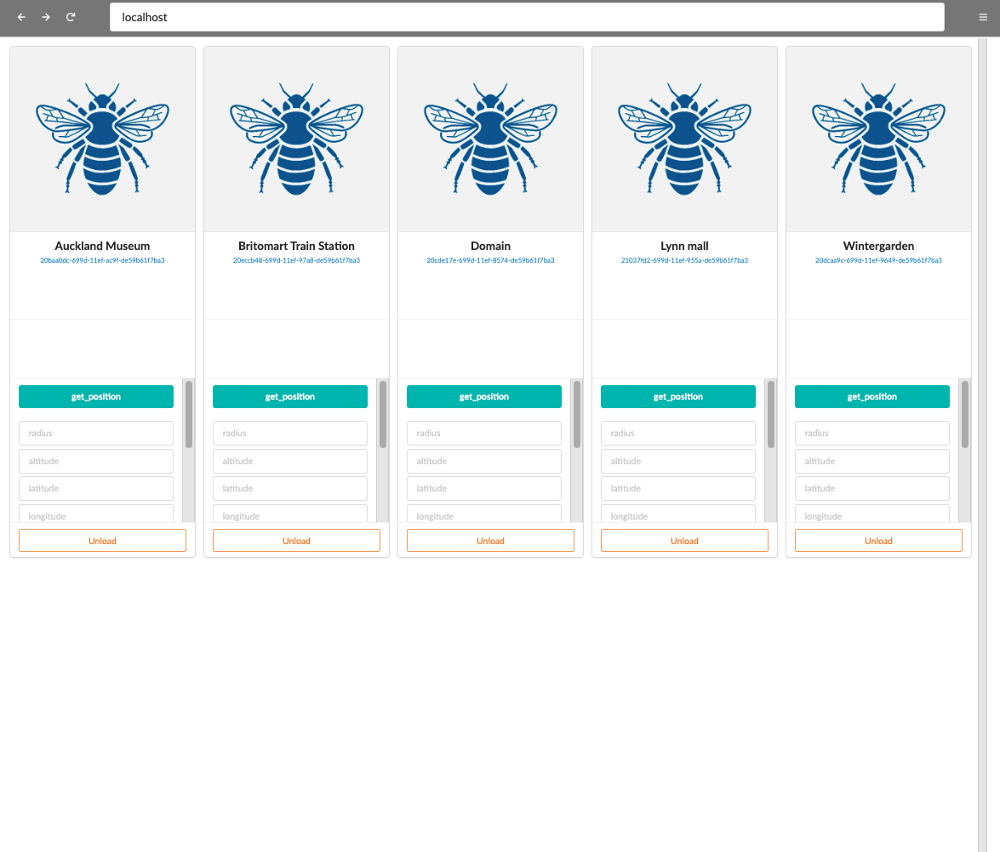
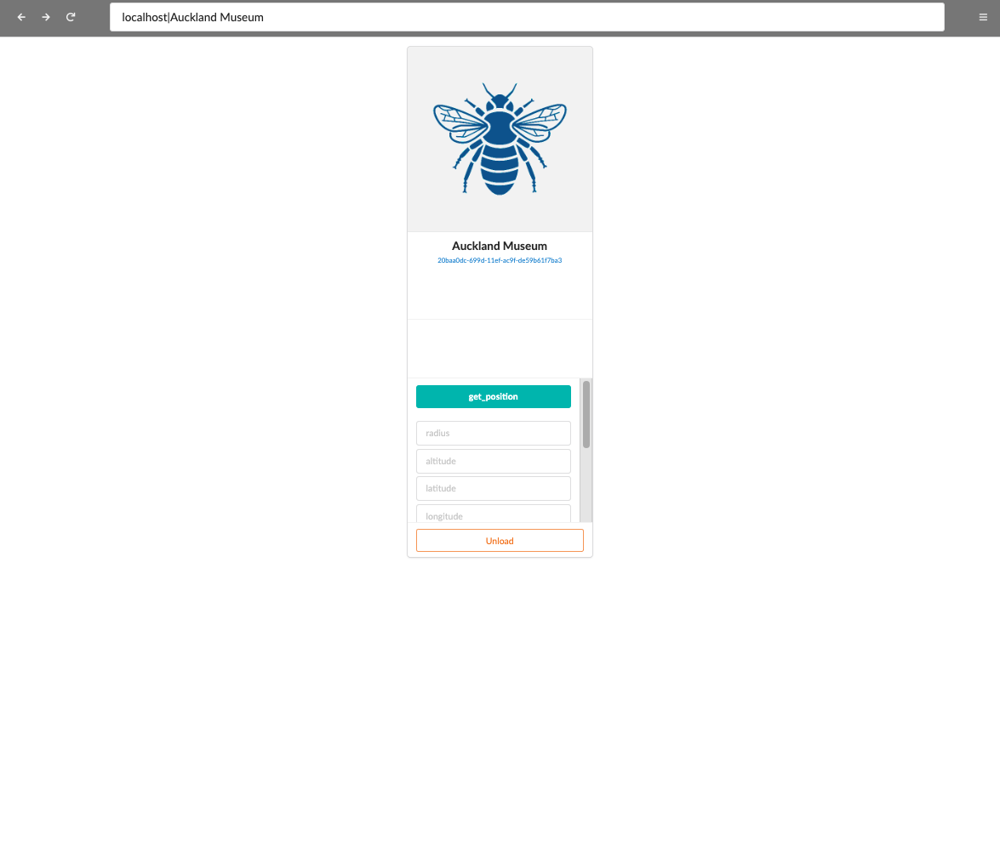
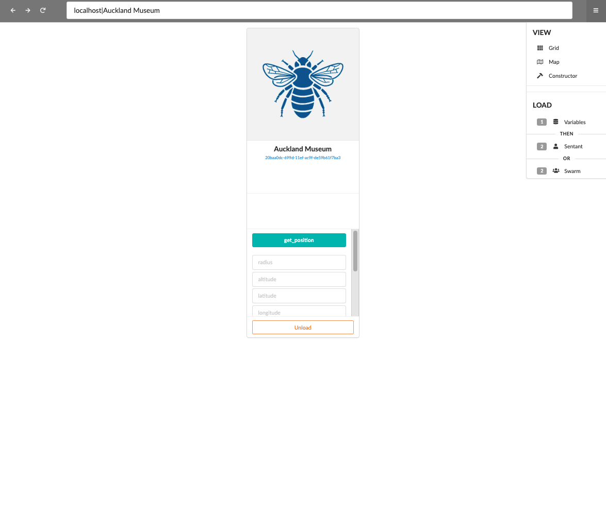
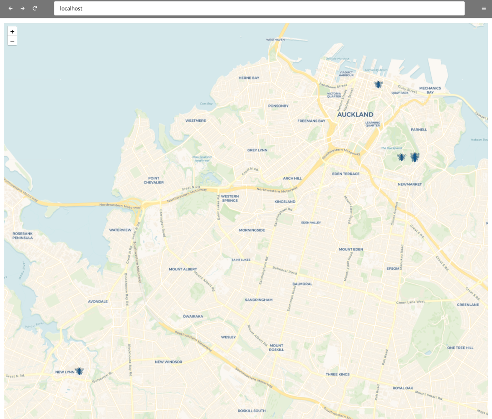
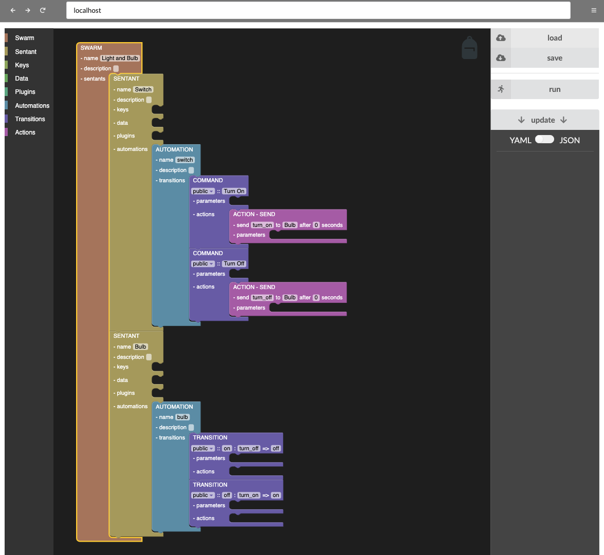

# Default WebApp

When you first install a Reality2 Node, it comes with a default WebApp.  You can completely replace this, of course.  We are regularly adding features to this WebApp, so check beck here often.

The WebApp is designed to look a bit like a regular web browser, and if you press the F11 key (or fn-F11 on some computers), it will go full screen and give the illusion of being a browser.

At the top left; the back, forward and reload buttons work as you might expect, going between Grid view and an individual Sentant and back again, for example.

The centre text box contains the Sentant Path.  This is a line separated path from the current node to the sentant of interest.  Presently, this would only be the the Node IP address and the Sentant Name, for example: `localhost|Auckland Museum`

On the RIght hand side, there is a menu with three modes: Grid, Map and Constructor.  Others may be added later.

Map view can be used to show Sentants that have the Geospatial plugin activated.  Presently, this only has very basic functionality.

And the Constructor view allows you to use the Blockly system to construct Swarms and Sentants in a non-textual manner.  ***This is not fully functioning as yet*** .

