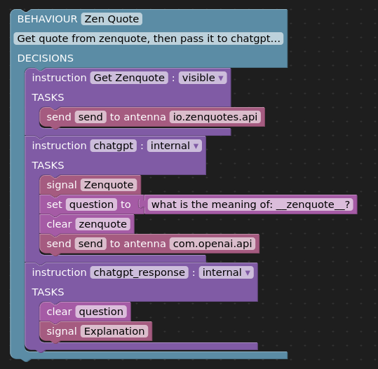

Welcome to Reailty2.  This page will give you a high-level understanding of what the Reality2 system can do and, to some extent, how it works.

`In technical terms, Reality2 is an embodied agent-based, distributed platform designed to run on a wide selection of networked, Linux-based devices, from wearables to PCs to cloud virtual machines.`

But, what does all this actually mean?  To explain, we are using the metaphor of a beehive.

## Bees (Beneficent Entities) and Swarms

Imagine, if you will, that you have a swarm of friendly, intelligent, digital bees that are with you all the time and will help you out when interacting with digital technologies and tools whilst protecting you (and your data).  `Each Bee is a Sentient Digital Agent, or 'Sentant'.`

Groups of Bees working together form Swarms.  Swarms and Bees may (soon) be downloaded from a Library (or Hive).  Presently, there are some examples [here](https://github.com/reality-two/reality2-definitions).

*Perhaps you have a Bee that manages your payment when you go into a store, or one that finds interesting junk shops nearby.*

#### A simple Swarm with one Bee

## Conducting

You conduct the behaviours of your Bees through the various devices you might have with you, such as your mobile phone, watch or headphones.  Bees understand human gestures and nuances well.  `Technically, this goes through a GraphQL API, and the interaction uses the device sensors.`

*Perhaps you might conduct a Bee to put your slide deck on the Relaity2-enabled screen.*

## Signalling

Bees signal you and each other when they want to communicate.  `As with Conducting, this goes through the GraphQL API.`  First, you tell your Bee what you are interested in, then it will let you know when there is something of interest.

*You might set up a Bee to warn you if your blood-sugar level is getting too low, connected to your continuous glucose monitor.*

## Antennae

Bees come with a suite of inbuilt capabilities, but can extend their intelligence and senses by using 'antennae'.  `Technically, these are either programmed or API-linked plugins.`  Antennae help Bees sense the digital and physical environment, perform intelligent analysis, and support intuitive interaction.

*You can have antennae for linking to ChatGPT, or for reading a weather sensor, for example.*

#### Antennae for ChatGPT and Zenquotes

## Behaviours

You can instruct your Bees to do things for you by defining behaviours.  `Technically, these are finite-state machines with events coming from the API or other Sentants.`  Premade behaviours can be downloaded from the Reality2 Hive as well.

#### A Behaviour with some Decisions and Tasks

## Decisions

Bees have to make decisions depending on their current state of mind, and the events that are happening in the world they can sense.  `Behaviours are 'Automations' in finite-state machines, whilst Decisions are 'Transitions'.`

## Tasks

Once a decision has been made, it is time to act.  Bees have tasks `(which are 'Actions' in the Finite-State Machine terminology)`.  There is a wide variety of tasks that your Bees can perform, augmented by their Antennae.

*Perhaps you have a Bee programmed to get a daily quote to inspire you, using ChatGPT to explain what it actually means (like* https://github.com/reality-two/reality2-definitions/blob/main/bees/zenquote_to_chatgpt.bee.yaml*).*

## What next?

At the moment, this tool is still in its infancy, but one day, we hope that you will see the 'Reality2 enabled' Bee logo on devices, places and events, and breathe a sigh of relief because you know, therefore, that your Bees will make the experience calm and enjoyable.

For more details, check out the documentation of the [Construct mode](./construct.md) built into the default Sentant Viewer.