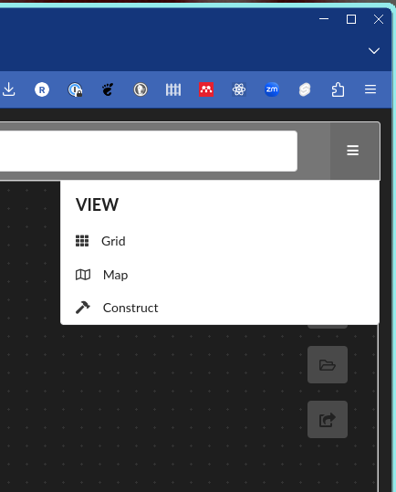
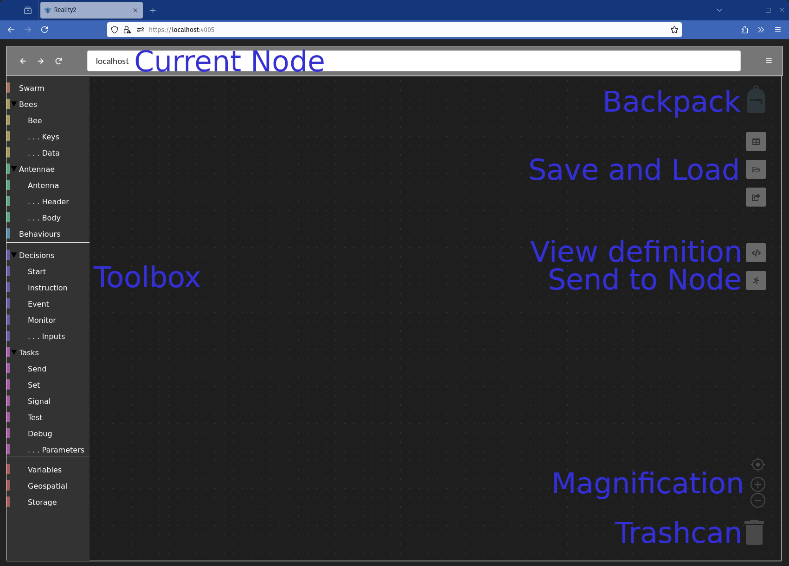

# Constructing Swarms and Bees for Reality2 Nodes

Each Reality2 node comes with its own web server, and a default WebApp.  After installing a Reality2 Node, you can use the default WebApp to construct Swarms, Bees, Antennae and Behaviours.

## Starting the default WebApp

Once you have a Reality2 Node running on your machine, open a browser, and go to `https://localhost:4005`.  Or, if you have a Reality2 node running at another location, open your browser to that location, eg `https://192.168.10.5:4005`.

## Construct mode

To enter construct mode, use the dropdown menu at the top right of the WebApp, and select `construct`.

You can also go directly to construct mode by adding `/?construct` to the end of the url, for example `https://localhost/?construct`.  In the same way, you can go directly to map mode with `/?map`.

## Main screen

When loaded, you should see something like the following:

The Toolbox contains the pieces to construct your definitions from; the Backpack holds pieces loaded from the disk; the place where the definition will be laoded is shown in the Current node (note, this can be different from the URL used in the browser, so you might use one Node to edit Swarms on another Node); and the right hand side has various functions which will be described below.
