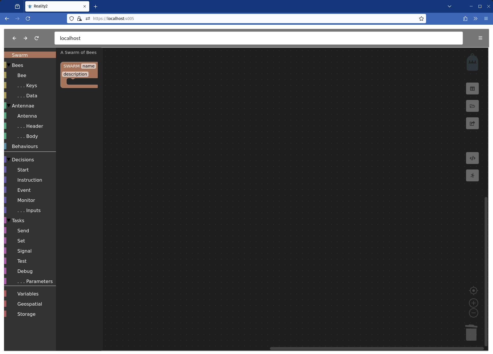
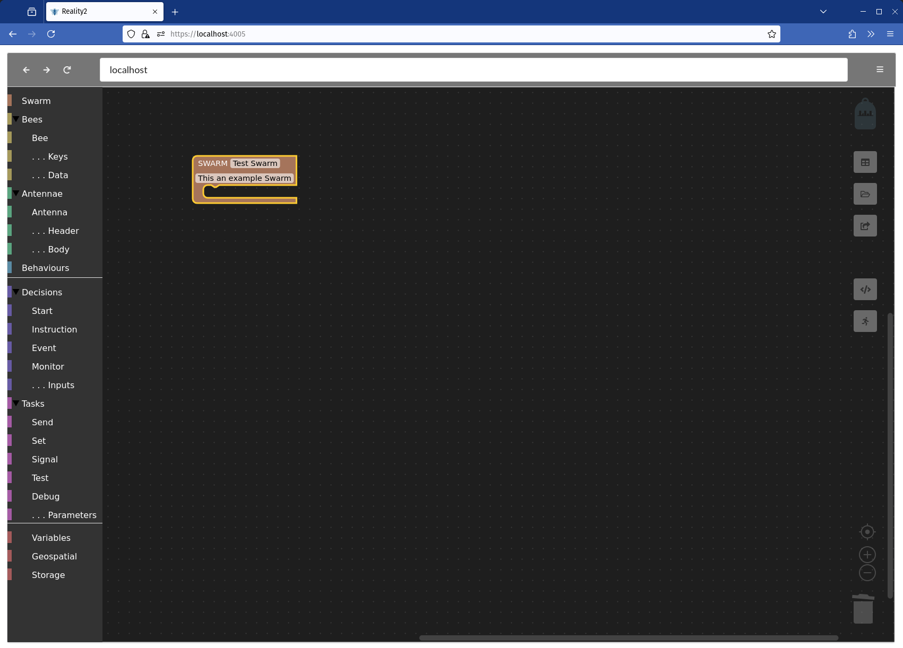
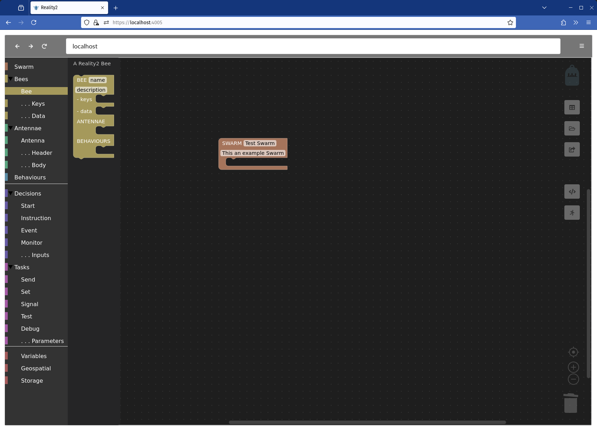
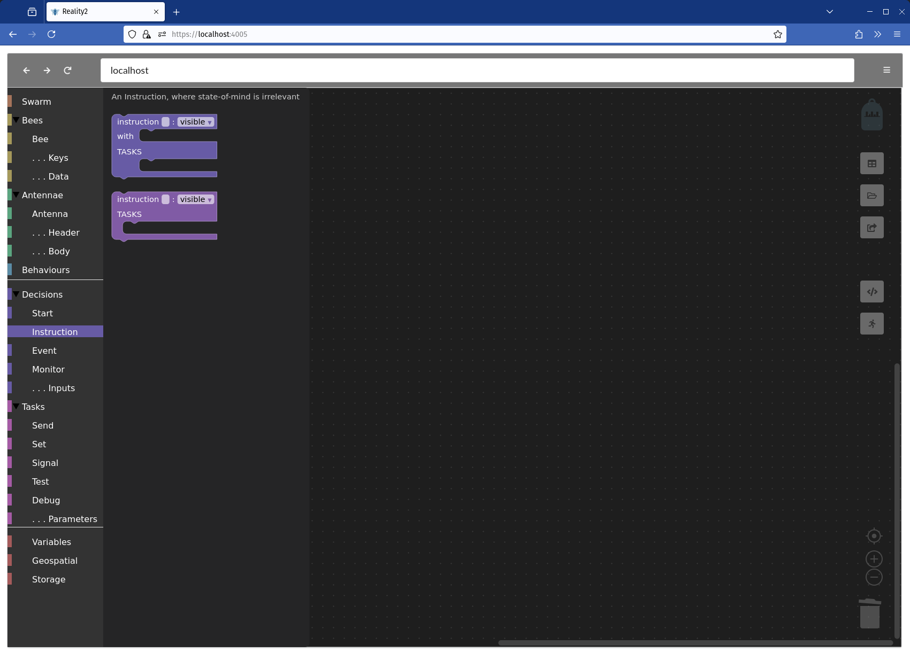
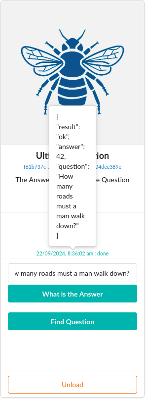

# Constructing Swarms and Bees for Reality2 Nodes

Each Reality2 node comes with its own web server, and a default WebApp.  After installing a Reality2 Node, you can use the default WebApp to construct Swarms, Bees, Antennae and Behaviours.

## Starting the default WebApp

Once you have a Reality2 Node running on a node, open a browser, and go to `https://[IP Address]:4005`, eg `https://192.168.10.5:4005`.  This may be the same computer the node is installed on, in which case: `https://localhost:4005`.

## Construct mode

To enter construct mode, use the dropdown menu at the top right of the WebApp, and select `Construct`.

You can also go directly to construct mode by adding `/?construct` to the end of the url, for example `https://localhost:4005/?construct`.  In the same way, you can go directly to map mode with `/?map`.

## Main screen

When loaded, you should see something like the following:

The Toolbox contains the pieces to construct your definitions from; the Backpack holds pieces loaded from the disk; the place where the definition will be laoded is shown in the Current node (note, this can be different from the URL used in the browser, so you might use one Node to edit Swarms on another Node); and the right hand side has various functions which will be described below.  The main workspace is where is you construct your Swarm.

The user experience is created using the opensource library [blockly](https://developers.google.com/blockly/guides/get-started/what-is-blockly).

## Swarms

The main unit is the digital 'Bee', short for 'BEneficient Entity'.  Elsewhere, you may find Bees referred to as Sentants.  'Sentant' is the more technical term and stands for 'Sentient Digital Agents'.

A grouping of Bees working together is (of course) a Swarm.

You don't always have to create an entire Swarm, you can create individual Bees (or indeed Antennae or Behaviours as well).

When creating a Swarm, the Bees don't have to be all combined togeher under the Swarm block.  The two images below represent the same Swarm.

### Creating a Swarm

To begin, drag a Swarm block from the toolbox, and fill in an appropriate name and optional description.

### Adding a Bee

The next step is to add Bees.  In a similar way, drag a Bee from the toolbox.

And either add it to the Swarm, or let it fly free in the work area.

#### Keys and Data

Bees have some optional Data, and encryption / decryption Keys.  The former is arranged as key / value pairs, where the keys are strings, and the values can be numbers, strings, boolean (true / false) or JSON.  The latter are used when storing data on a node to ensure it is kept secure (see below).

#### Antennae and Behaviours

Bees can also have Antennae - to connect to capabilities elsewhere on the Internet, and Behaviours - which are how you tell Bees what you want them to do.  Both of these are covered below.

### Antennae

Bees can have their core functionality extended by either internal or external plugins.  The latter are termed 'Antennae'.  Essentially, these allow Bees to work with Application Programming Interfaces (APIs).

The examples below show two Antennae, one for ChatGPT and one for Zenquotes.

There are two ways to interact with APIs, namely GET and POST.  The former is usually used for simpler APIs, whereas the latter is often used where the API has complex functionality and interactive capabilities.

#### GET Antennae

GET APIs typically contain information to be sent in the '`Headers`' and in the `query` itself, and received information back after a period of time.

In the Zenquote API above, the `query` is: `https://zenquotes.io/api/random`, and a `header` is required `Content-Type = application/json`.

The data is received back in [JSON format](https://en.wikipedia.org/wiki/JSON), and has to be unpacked to get at the actual quote.  For example, using the above query in a browser gives the following (if you try this, you'll likely get a different random quote):

The `OUTPUT` section of the Antenna defines how to unpack the returned data, and what to send further.  This uses something called a JSON Path, which is a way of navigating through the JSON returned by the API.

In the example above, when the reply comes back, data with the name 'zenquoute' is set to `0.q` which means: take the first element of the array, and the key `q`.  Which in the call above would be the text: `Life is either a daring adventure, or nothing.`.  This is then sent as an event called `chatgpt`, which you will see later is picked up by one of the Behaviours.

#### POST Antennae

APIs that use POST require more information, such as credentials, and to chose from a greater array of possible capabilities.  The OpenAI API is like this.  The only way to know how these APIs are constructed is to go to their developer help pages.

As with GET, POST Antennae have a `query`, `headers` and an `OUTPUT`.  Additionally, there is a `body` section.

An example of how an API documentation typically looks is as follows (from OpenAI):

These can be quite complex, so we are building a library of ready-made Antennae, presently available [through GIThub](https://github.com/reality-two/reality2-definitions), but soon on its own site where, everyone will be able to share the useful bits and pieces they have made.

### Behaviours

Behaviours are how to tell Bees what you want them to do, and is the subject of the rest of this documentation.  To add a Behaviour to your Bee, drag it from the Toolbox and slot it into the correct place, as below.

Note that you can have many behaviours for each Bee, as in the image above.  Generally, it pays to keep Decisions grouped logically into different Behaviours.

#### States (of Mind)

In technical terms, each behaviour on a Bee, or Sentant is a Finite State Machine.  This means that each Behaviour represents a 'State of mind' for a Bee.  Since it can have many Behaviours, it can have many States of Mind.  Some of the Decisions don't use the State of Mind capability, and therefore act more like Commands to the Bee to do something.  However, using States of Mind cna greatly increase the complexity and capability of the decisions to be made.

For example, consider a Toggle Switch.  If the light is on, when you press the switch, it turns off, and likewise, if it is off, when you press the switch, it turns on.  To achieve this requires the Bee to remember what state it is currently in (on or off), and then to act accordingly.

Each Behaviour has its own State, meaning that a single Bee can have many different States of Mind at the same time, each acting independently of each other.

### Decisions

Before delving into how to add decisions, let's consider how a Bee knows about the space it is in, how it responds to external and internal stimuli and how it communicates with other devices.

#### Events

The only way a Bee can be influenced is by receiving `events`.  Events can come from various sources such as another Bee, a Bee's antennae, from Internal processes, and as a result of Tasks.  Whether a Bee responds to an event is defined in the Behaviours and subsequent Decisions and Tasks.

One of the most powerful capabilities is that events can be sent from one Bee to another, as illustrated in the setup below:

In this example, there is a Swarm with three Bees.  The first is a Light Switch, the second is a Light Bulb, and the third is a Bee that works with a Python script to control a Raspberry Pi's pins to turn a LED on and off.  A simplified (and slightly inaccurate) diagram shows the linkages below.

#### Signals

The signal pointing to 'External' allows us to monitor the state of the Light Bulb from another device.  The Raspoberry Pi Bee uses the same technique to send a message with appropriate data to the Python Script that then turns the LED on and off.  Therefore, Events allow us to send information to Bees, whereas Signals allow us to receive information from Bees.

#### Types of decision

##### Start

When a Bee first starts, it begins in the `start` state, and the `init` event is triggered.  You can then choose which state-of-mind it will take, and perform some tasks, or you can just ignore the state-of-mind if it's not necessary.

##### Instructions

 

Commands are the simplest way to instruct Bees, essentially saying 'regardless of your state-of-mind, do this now'.  So, in the example above, the first Instruction asks a question, to which the asnwer s always '42', whilst the second instruction Asks the Bee "Deep Thought' what the question actually is, and signals when it is done (asking the question, not getting the answer).

Notice that the first Decision includes some information about the allowed inputs, in this case a 'question' which is a string (of characters).  Also, notice that is defined as being 'visible'.  Instructions can be `visible` or `internal`.

Looking at the subsequent drawing of the Bee on the WebApp, you can see how the Instructions become Buttons to press when visible.

##### Events

##### Monitor