# Constructing Swarms and Bees for Reality2 Nodes

Each Reality2 node comes with its own web server, and a default WebApp.  After installing a Reality2 Node, you can use the default WebApp to construct Swarms, Bees, Antennae and Behaviours.

## Starting the default WebApp

Once you have a Reality2 Node running on a node, open a browser, and go to `https://[IP Address]:4005`, eg `https://192.168.10.5:4005`.  This may be the same computer the node is installed on, in which case: `https://localhost:4005`.

## Construct mode

To enter construct mode, use the dropdown menu at the top right of the WebApp, and select `Construct`.


You can also go directly to construct mode by adding `/?construct` to the end of the url, for example `https://localhost:4005/?construct`.  In the same way, you can go directly to map mode with `/?map`.

## Main screen

When loaded, you should see something like the following:


The Toolbox contains the pieces to construct your definitions from; the Backpack holds pieces loaded from the disk; the place where the definition will be laoded is shown in the Current node (note, this can be different from the URL used in the browser, so you might use one Node to edit Swarms on another Node); and the right hand side has various functions which will be described below.  The main workspace is where is you construct your Swarm.

The user experience is created using the opensource library [blockly](https://developers.google.com/blockly/guides/get-started/what-is-blockly).

**Show Definition** opens a side panel to show you the actual Sentant / Bee definition that will be used to create the Bee.  For example:


Note the example above includes also a table of keys used by the Bee for various purposes.  The __encryption_key__ and __decryption_key__ are used by some of the actions when saving and loading data to and from the node, whereas the __open_api_key__ is used by the OpenAI Behaviour.  
Use the 


 icon to open a JSON file containing the keys, for example:

```json
{
    "__openai_api_key__": "sk-[your OpenAI API key]",
    "__encryption_key__": "a 64bit encoded encryption key",
    "__decryption_key__": "a 64bit encoded decryption key"
}
```

### Workflow


Typically, you would load a definition file into the Construct window, or create it from scratch, perhaps from parts loaded from elsewhere (such as Antennae / plugins).  To use it, you have to 'Send it to the Node', whereupon you can change to view mode, test the functionality, perhaps save it, or go round again to tweak it in Construct mode.

NOTE: Bees are not running on the Reality2 Node until they are 'Sent'.  So, just because you can see a Bee in the construct mode, doesn't, necessarily, mean that it is running.

## Swarms

The main unit is the digital 'Bee', short for 'BEneficent Entity'.  Elsewhere, you may find Bees referred to as Sentants.  'Sentant' is the more technical term and stands for 'Sentient Digital Agents'.

A grouping of Bees working together is (of course) a Swarm.

You don't always have to create an entire Swarm, you can create individual Bees (or indeed Antennae or Behaviours as well).

When creating a Swarm, the Bees don't have to be all combined togeher under the Swarm block.  The two images below represent the same Swarm.

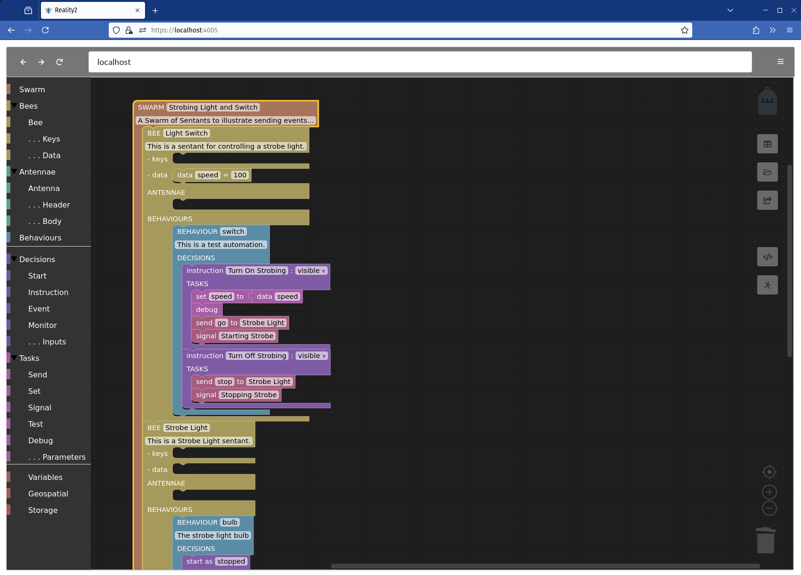


### Creating a Swarm

To begin, drag a Swarm block from the toolbox, and fill in an appropriate name and optional description.


### Adding a Bee

The next step is to add Bees.  In a similar way, drag a Bee from the toolbox.


And either add it to the Swarm, or let it fly free in the work area.


#### Keys and Data

Bees have some optional Data, and encryption / decryption Keys.  The former is arranged as key / value pairs, where the keys are strings, and the values can be numbers, strings, boolean (true / false) or JSON.  The latter are used when storing data on a node to ensure it is kept secure (see below).

#### Antennae and Behaviours

Bees have Antennae - to connect to capabilities elsewhere on the Internet, and Behaviours - which are how you tell Bees what you want them to do.

### Antennae

Bees can have their core functionality extended by either internal or external plugins.  The latter are termed 'Antennae'.  Essentially, these allow Bees to work with Application Programming Interfaces (APIs).

The examples below show two Antennae, one for ChatGPT and one for Zenquotes.


There are two ways to interact with APIs, namely GET and POST.  The former is usually used for simpler APIs, whereas the latter is often used where the API has complex functionality and interactive capabilities.

#### GET Antennae

GET APIs typically contain information to be sent in the '`Headers`' and in the `query` itself, and received information back after a period of time.

In the Zenquote API above, the `query` is: `https://zenquotes.io/api/random`, and a `header` is required `Content-Type = application/json`.

The data is received back in [JSON format](https://en.wikipedia.org/wiki/JSON), and has to be unpacked to get at the actual quote.  For example, using the above query in a browser gives the following (if you try this, you'll likely get a different random quote):


The `OUTPUT` section of the Antenna defines how to unpack the returned data, and what to send further.  This uses something called a JSON Path, which is a way of navigating through the JSON returned by the API.

In the example above, when the reply comes back, data with the name 'zenquoute' is set to `0.q` which means: take the first element of the array, and the key `q`.  Which in the call above would be the text: `Life is either a daring adventure, or nothing.`.  This is then sent as an event called `chatgpt`, which you will see later is picked up by one of the Behaviours.

#### POST Antennae

APIs that use POST require more information, such as credentials, and to chose from a greater array of possible capabilities.  The OpenAI API is like this.  The only way to know how these APIs are constructed is to go to their developer help pages.

As with GET, POST Antennae have a `query`, `headers` and an `OUTPUT`.  Additionally, there is a `body` section.

An example of how an API documentation typically looks is as follows (from OpenAI):


These can be quite complex, so we are building a library of ready-made Antennae, presently available [through GIThub](https://github.com/reality-two/reality2-definitions), but soon on its own site where, everyone will be able to share the useful bits and pieces they have made.

### Behaviours

Behaviours are how to tell Bees what you want them to do, and is the subject of the rest of this documentation.  To add a Behaviour to your Bee, drag it from the Toolbox and slot it into the correct place, as below.


Note that you can have many behaviours for each Bee, as in the image above.  Generally, it pays to keep Decisions grouped logically into different Behaviours.

#### States (of mind)

In technical terms, each behaviour on a Bee / Sentant is a Finite State Machine.  This means that each Behaviour represents a 'State of mind' for a Bee.  Since it can have many Behaviours, it can have many States of Mind.  Some of the Decisions don't use the State of Mind capability, and therefore act more like Commands to the Bee to do something.  However, using States of Mind can greatly increase the complexity and capability of the decisions to be made.  

In the example below, there are two states, `on` and `off`, with the events `Turn_On` and `Turn_Off` causing it to change state.  Maybe the events represent the flicking of a light switch.

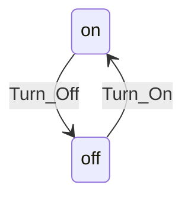

In this example, if the light is already on, a `Turn_On` event won't change anything, likewise a `Turn_Off` event if the switch is already off.

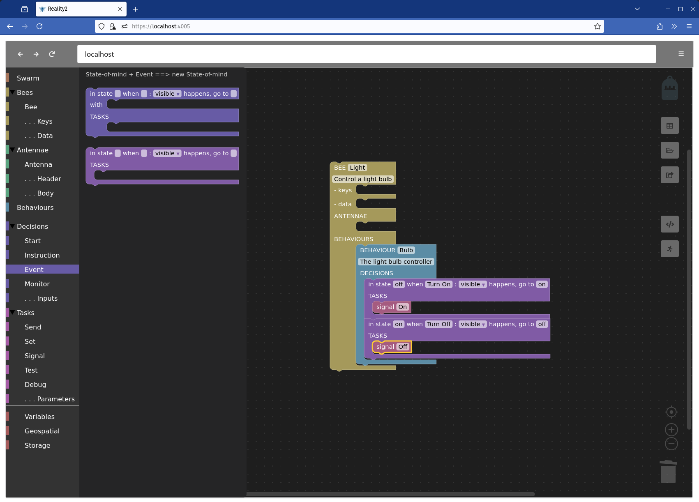

Each Behaviour has its own State, meaning that a single Bee can have many different States of Mind at the same time (because it can have many behaviours), each acting independently of the others.

### Decisions

Before delving into how to add decisions, let's consider how a Bee knows about the space it is in, how it responds to external and internal stimuli and how it communicates with other devices.

#### Events

The only way a Bee can be influenced is by receiving `events`.  Events can come from various sources such as another Bee, a Bee's antennae, from Internal processes, and as a result of Tasks.  Whether a Bee responds to an

 event is defined in the Behaviours and subsequent Decisions and Tasks.


One of the most powerful capabilities is that events can be sent from one Bee to another, as illustrated in the setup below:

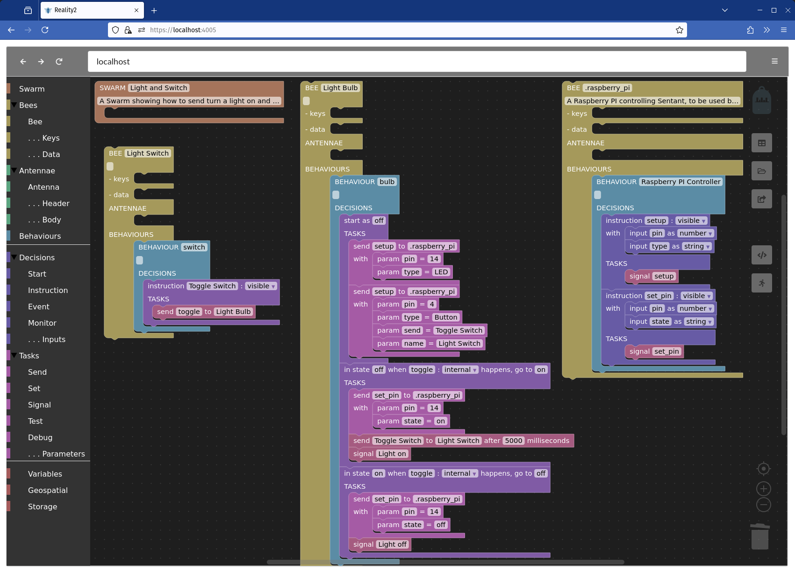

In this example, there is a Swarm with three Bees.  The first is a Light Switch, the second is a Light Bulb, and the third is a Bee that works with a Python script to control a Raspberry Pi's pins to turn a LED on and off.  A simplified (and slightly inaccurate) diagram shows the linkages below.


#### Signals

The signal pointing to 'External' allows us to monitor the state of the Light Bulb from another device.  The Raspoberry Pi Bee uses the same technique to send a message with appropriate data to the Python Script that then turns the LED on and off.  Therefore, Events allow us to send information to Bees, whereas Signals allow us to receive information from Bees.

#### Types of decision

There are several types of Decision, as described below.  Further, Decisions may, or may not, have prescribed Inputs, which allow you to define how the Instruction or Event look to enquiring external devices.

##### Start


When a Bee first starts, it begins in the `start` state, and the `init` event is triggered.  You can then choose which state-of-mind it will take, and perform some tasks, or you can just ignore the state-of-mind if it's not necessary.

##### Instructions


Commands are the simplest way to instruct Bees, essentially saying 'regardless of your state-of-mind, do this now'.  So, in the example above, the first Instruction asks a question, to which the asnwer s always '42', whilst the second instruction Asks the Bee "Deep Thought' what the question actually is, and signals when it is done (asking the question, not getting the answer).

Notice that the first Decision includes some information about the allowed inputs, in this case a 'question' which is a string (of characters).  Also, notice that is defined as being 'visible'.  Instructions can be `visible` or `internal`.

Looking at the subsequent drawing of the Bee on the WebApp, you can see how the Instructions become Buttons to press when visible.

##### Events

The most fullsome type of Decision is the `Event` which includes the Bee's 'state-of-mind' when deciding what to do with a given `event` with `inputs`.


In the example above, the 'Strobe Light' Bee uses these to make decisions what to do in certain circumstances.  For Example:

**'in state * when stop: internal happens, go to stopped' means:**

- From any state, if a 'stop' event is received, change to state 'stopped'.  There are no tasks, so there is no further action.  The event is defined as 'internal', so can only come from within internal sources such as a Bee on the same node, or another Behaviour on the same Bee.

**'in state * when go: internal happens, go to off' means:**

- From any state, if a 'go' event is received, change to state 'off'.  In this case, when this happens, a 'turn_on' event is issued directly, which will be picked up by the Decision below.

**'in state off when turn_on: internal happens, go to on' means:**

- From state 'off', if a 'turn_on' event is received, change to state 'on'.  When this happens, some actions occur, namely, setting the delay to the 'speed' (a value coming in from the Bees inbuilt Data), a turn_off event is sent (after the period of time defined by the delay), and a signal is sent to watching devices of 'turn_on'.

**'in state on when turn_off: internal happens go to off' means:**

- From state 'on', if a 'turn_off' event is received, change to state 'off'.  When this happens, some actions occur, namely, setting the delay to the 'speed', a turn_on event is sent after the delay, and a signal is sent to watching devices of 'turn_off'.

The net effect of this is that when the Bee received a 'go' event, it oscilates between 'on' and 'off' with a frequency of 'speed' milliseconds, sending signals to any watching device, such as some electronics controlling a light bulb.  When it receives a 'stop' event, it stops doing that.

##### Monitor

Bees exist on Nodes, which is the hardware they reside in.  There are some internal signals that may be of interest such as the coming and going of other Bees, and the joining and leaving of networks.  A typical example is within the default WebApp, the monitor functionality is used to know when Sentants are created and deleted in order to update the user interface.

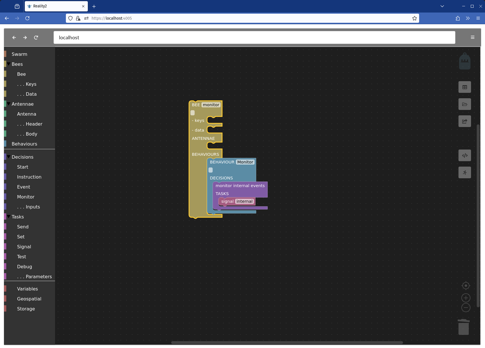

**Types of internal event**

Presently, the following internal events occur:

- created - when a Sentant / Bee is created.  The name and ID of the Bee is included.
- deleted - when a Sentant / Bee is deleted.  The name and ID of the Bee is included.

The following internal events are to come soon:

- entering - when a Node enters the network proximity of another node.
- leaving - when a Node leaves the network proximity of another node.

This will allow Bees to enquire about the availability of Bees, and their external interfaces in the network being entered, and interact with them if so desired.

### Tasks

Tasks are how Bees get to do stuff, to affect the world around them, and interact with other Bees.  There are inbuilt capabilities that all Bees on all nodes have, and optional capabilities that some Nodes have that Bees may use.  In technical terms, these are in-built plugins, whereas the 'Antennae' are external plugins.

#### Data Flow

Data accumulates as tasks get performed, one after the other.  We call this the 'Data Flow'.  Further, as events get sent from one place to another, the accumulated Data Flow goes with that event, gets added to it, and comes back with the returned data.


For example, in the above Bee, data flows as follows:

1. The Instruction 'Ask ChatGPT' has an input parameter, 'question' (which is a string of characters), so the Data Flow could be:

   ```json
   {"question": "What is pi in 10 words or less?"}
   ```

2. This comes into the Decision and is then sent to the Antenna 'com.openai.api', which is sent inside the body with the `messages`: `[{"role":"system","content":"You are a helpful assistant."},{"role":"user","content":"__question__"}]`

   - Notice here also the '__question__'.  Sometimes, you need to substitute text in, say, data sent in the body of a POST API with something that has come from elsewhere, such as the question in this case.  Putting double underscores on either side of a string of characters tells the Node to replace that with the contents of the variable in the Data Flow, in this case the question "What is pi in 10 words or less?".

3. When OpenAI comes back with an answer, the Data Flow has the answer appended, for example:

   ```json
   {"question": "What is pi in 10 words or less?", "answer": "Pi is the ratio of a circle's circumference to its diameter."}
   ```


4. This is picked up by the second Decision 'chatgpt_response', and the data 'question' is removed, to give:

   ```json
   {"answer": "Pi is the ratio of a circle's circumference to its diameter."}
   ```


5. This is sent as a signal with 'ChatGPT Answer' (and some data saying the result is 'ok'), as shown below.


You can specify data required by an action either directly, or by accumulating it in the Data Flow.

In the example below, when the Bee is started, it grabs a default latitude and longitude from the inbuilt data, and sets the initial location.  Then, a behaviour is used to set a new latitude and longitude based on user input.  In both cases, `set location`uses the latitude and longitude in the Data Flow.


#### Types of Task

##### Send

As the name suggests, the 'send' action is about sending events.  You can send immediately, send after a delay (in milliseconds), and send to an Antenna.

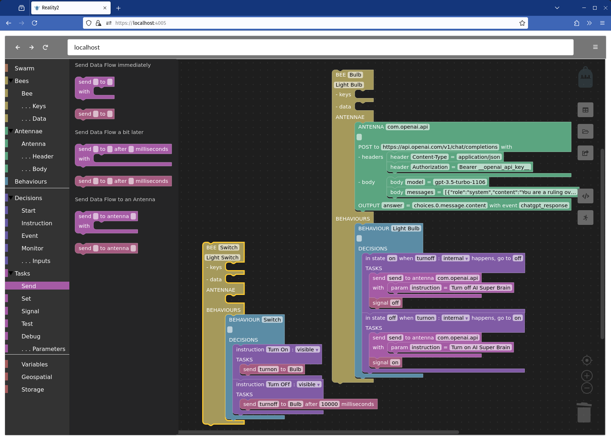

If the 'to' field is left blank, it is sent to the current Bee (as opposed to a different one).

##### Set

The Set task allows you to work with data in the Data Flow.  In the example below, the set command is used in various ways to get data, navigate a JSONPath, remove or clear a variable from the Data Flow.

Note in particular how JSONPath can also include references to variables in the Data Flow, ie: `prime_data.primes.__counter__` means in the JSON data called `prime_data`, go into the `primes` object, and pick out the element from that array defined by the value of `counter`.


You can either clear data from the Data Flow, or set data.  Data can be comprised of a JSONPath, extracted from the immutable data built into the Bee, be a calculation, or simply a number, string of characters, true, false or JSON.

##### Signal

The signal task is for communicating with devices and WebApps that are connected to the Sentant through the 'subscription' aspect of the GraphQL API.  You can either just send a signal, which takes all the data in the current Data Flow, and sends it out to any device that is subscribed to that signal, or, you can also add some parameters to go along with the Data Flow.


##### Test

Sometimes a decision has to be made, and then an event can be sent depending on the outcome.  As with other tasks, you can choose to add some additional parameters to the Data Flow.  In the example here, there is a test in the form of `if counter >= 4 send reset otherwise send increment to me`.


##### Debug

Debug is useful for checking out what the Data Flow is at that moment in the list of actions.  It would be the same as setting a signal with event 'debug'.

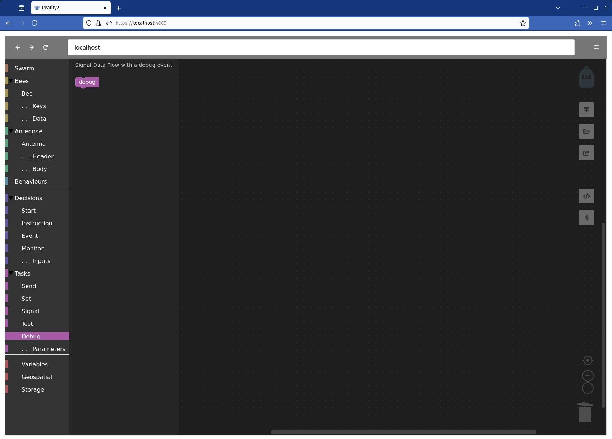

#### Plugin Tasks

Bees come with a set of core, inbuilt capabilities - Decisions and Tasks as above.  In addition, there can be Tasks supported by plugins, or Antennae.  The antennae above were defined through the definition file, as links to other capabilities and resources elsewhere on the intranet or internet.

Inbuilt Plugins or Antennae are included with the Node, and may vary from node to node, as below.  These may be built by Reality2 or others.

##### Variables

In programming, Variables are a way of describing data that can be worked on.  It might be strings of characters, numbers, the concepts of true or false, or much more complex entities (called data structures).

Data Flow variables are created and exist for the moment the Actions in the Decision exist.  If an event is being sent, the Data Flow can be passed on, but otherwise, each time a Decision begins afresh, the Data Flow is empty (though it may have some initial data from user Inputs).

Sometimes, however, you want to maintain some consistent data between Decisions.  To do this, we use the 'Variables' plugin.  Internally, this is the 'ai.reality2.vars' plugin.

Variables only exist for the life-time of the Bee.  If the Bee is deleted, this data is lost.


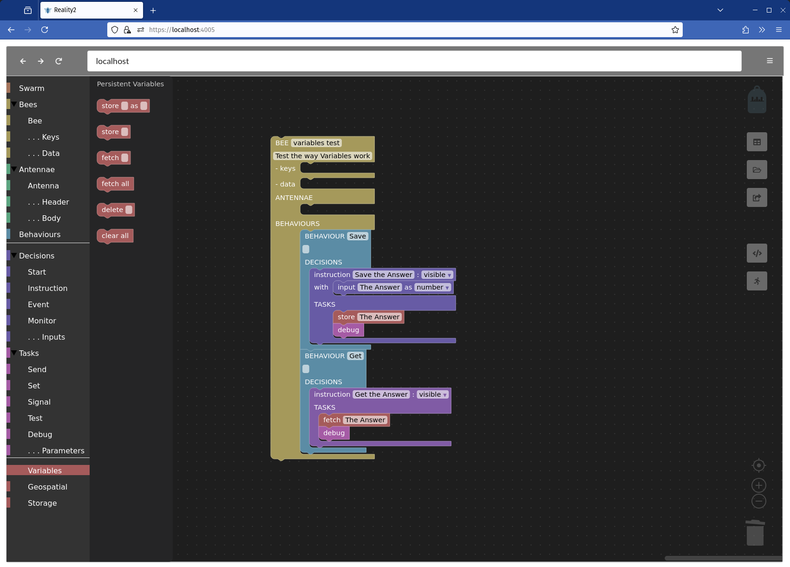


##### Geospatial

Sometimes, we want to be able to represent a location in the world.  Using geospatial coordinates: Latitude and Longitude allows us to do that.  The Geospatial set of Tasks works with geo-location, as well as Altitude.  You can also represent position by a '[GeoHash](https://en.wikipedia.org/wiki/Geohash)', which is a text-based representation of latitude and longitude.

The example below shows a minimal setup for a 'Geospatial' Bee that maintains its position (using variables), and illustrates how the 'Search within radius' functionality works.  Here, you see three Geospatial Bees.

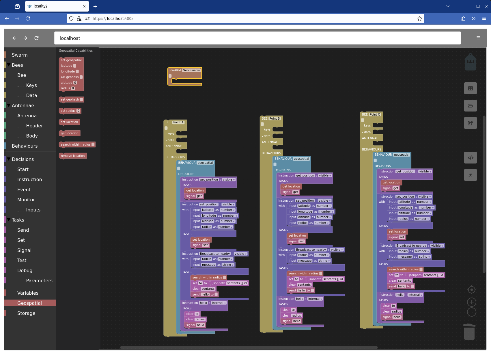

And, this is what it they may look like in map view.  Note that when the Bees are first created, they start off at location 0, 0 (just off the coast of Africa), so they need to be moved to the desired location (in this case, by dragging on the map).
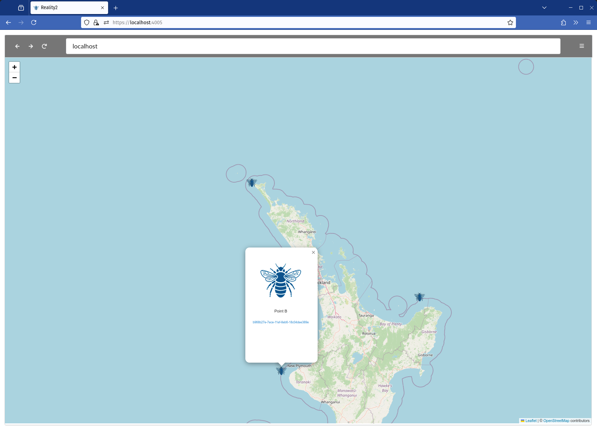

When the message is broadcast from Point A, Points B and C receive the 'hello' event with the message "Hello There" due to being within the radius given (in meters).

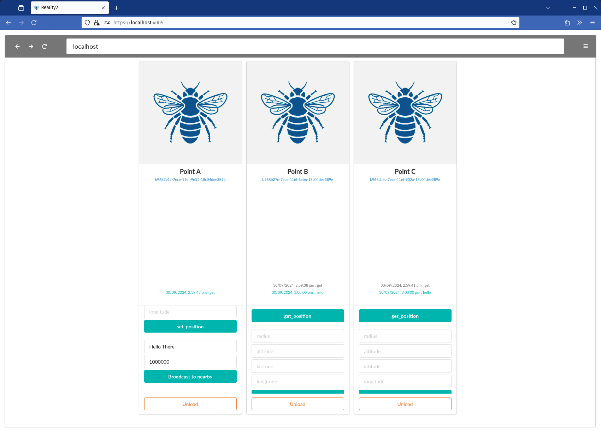


##### Storage

In a similar way the Variables plugin, the Storage plugin stores and retreives the Data Flow.  However, the retention of the information may extend beyond the life of the Bee.  The data is stored in a local database as an encrypted blob using the name of the Bee, so you need to include the encryption and decryption keys as well.

A new Bee (or an updated one) can retrieve the data only if it has the same name, and the same encryption and decryption keys, meaning that if you forget your keys, that data is lost.  But also, no-one else can get at it without the keys.

An example of how this is useful could be with the Geospatial Bees so that each time you tweak the programming, and reload the Bees (by first removing them and then adding them again), you don't have to move the Bees back to their locations.

Note the `load into data flow` command when the Bee is loaded at start, and the `save data flow` each time the location is set.

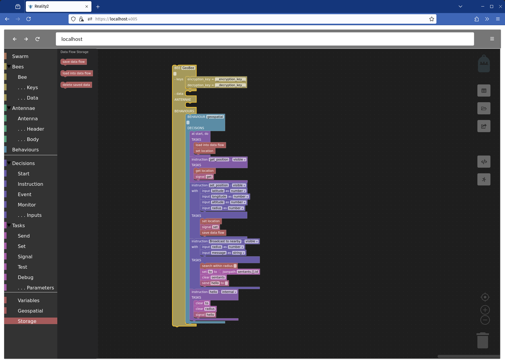